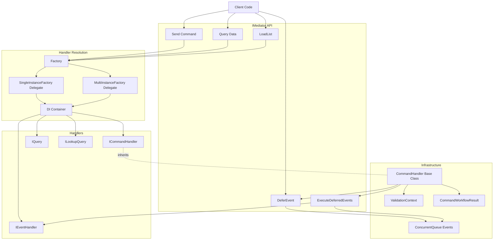
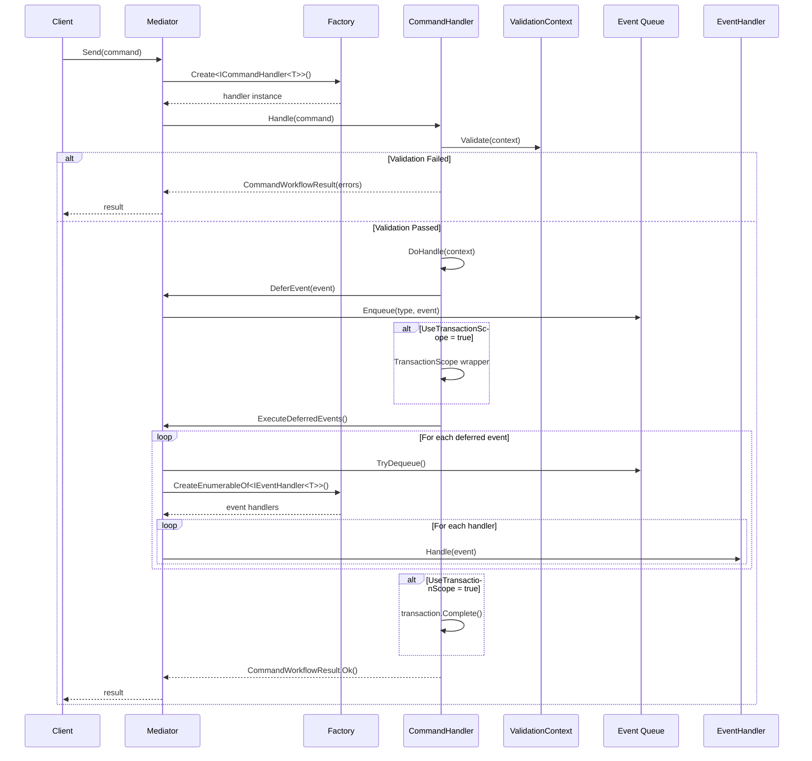
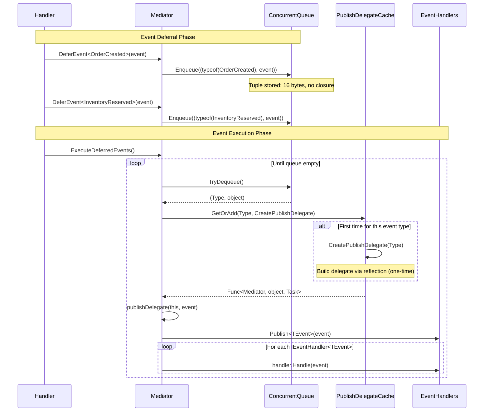

# AsyncMediator Architecture

A lightweight, high-performance mediator pattern implementation for .NET 9/10 with zero-allocation event deferral and minimal memory overhead.

## Design Philosophy

AsyncMediator is built on three core principles:

1. **Performance First**: Zero-allocation patterns, singleton caching, and minimal virtual dispatch
2. **Explicit Control**: TransactionScope is opt-in, not automatic
3. **Simple Abstractions**: Marker interfaces and factory delegates over heavyweight frameworks

## High-Level Architecture



## Core Components

### Factory Delegate Pattern

AsyncMediator uses function delegates instead of service locator anti-patterns. The DI container is accessed only at the mediator boundary, keeping handler code clean.

```csharp
public delegate object SingleInstanceFactory(Type serviceType);
public delegate IEnumerable<object> MultiInstanceFactory(Type serviceType);

internal class Factory(MultiInstanceFactory multi, SingleInstanceFactory single)
{
    public IEnumerable<T> CreateEnumerableOf<T>() where T : class =>
        multi(typeof(T)).Cast<T>();

    public T Create<T>() where T : class =>
        (T)single(typeof(T));
}
```

**Why this pattern:**
- Decouples from specific DI frameworks
- No service locator anti-pattern in handler code
- Easy testing: just provide mock factories
- Zero reflection overhead after handler resolution

### Command Flow



### Zero-Allocation Event Deferral

Event deferral avoids closure allocations by storing the event type and instance as a tuple.

```csharp
private readonly ConcurrentQueue<(Type EventType, object Event)> _deferredEvents = new();

public void DeferEvent<TEvent>(TEvent @event) where TEvent : IDomainEvent =>
    _deferredEvents.Enqueue((typeof(TEvent), @event!));
```

**Traditional approach (allocates closure):**
```csharp
_deferredEvents.Enqueue(() => Publish(@event));
```

**Our approach:**
- Stores `(Type, object)` tuple: 16 bytes on stack
- No closure allocation
- No captured variables
- Delegate cache eliminates reflection on hot path

### Cached Publish Delegates

Reflection is expensive. AsyncMediator caches publish delegates per event type.

```csharp
private static readonly ConcurrentDictionary<Type, Func<Mediator, object, Task>> PublishDelegateCache = new();

public async Task ExecuteDeferredEvents()
{
    while (_deferredEvents.TryDequeue(out var item))
    {
        var publishDelegate = PublishDelegateCache.GetOrAdd(item.EventType, CreatePublishDelegate);
        await publishDelegate(this, item.Event).ConfigureAwait(false);
    }
}

private static Func<Mediator, object, Task> CreatePublishDelegate(Type eventType)
{
    var method = typeof(Mediator)
        .GetMethod(nameof(PublishBoxed), BindingFlags.Instance | BindingFlags.NonPublic)!
        .MakeGenericMethod(eventType);

    return (mediator, @event) => (Task)method.Invoke(mediator, [@event])!;
}
```

**Performance impact:**
- First event of each type: reflection cost (one-time)
- Subsequent events: dictionary lookup (nanoseconds)
- Cache is static: shared across all mediator instances

## Command Handler Base Class

The abstract `CommandHandler<TCommand>` base class provides structure and removes boilerplate.

```csharp
public abstract class CommandHandler<TCommand>(IMediator mediator) : ICommandHandler<TCommand>
    where TCommand : ICommand
{
    protected TCommand Command { get; private set; } = default!;
    protected IMediator Mediator { get; } = mediator;
    protected virtual bool UseTransactionScope => false;

    public async Task<ICommandWorkflowResult> Handle(TCommand command)
    {
        Command = command;
        var context = new ValidationContext();

        await Validate(context).ConfigureAwait(false);
        if (context.ValidationResults.Count > 0)
            return new CommandWorkflowResult(context.ValidationResults);

        return UseTransactionScope
            ? await HandleWithTransaction(context).ConfigureAwait(false)
            : await HandleWithoutTransaction(context).ConfigureAwait(false);
    }

    protected abstract Task Validate(ValidationContext validationContext);
    protected abstract Task<ICommandWorkflowResult> DoHandle(ValidationContext validationContext);
}
```

**Key design decisions:**

1. **Validation first**: Validation errors short-circuit before `DoHandle`
2. **Transaction opt-in**: `UseTransactionScope` defaults to `false`
3. **Command property**: Available to all methods without parameter passing
4. **Mediator access**: Handlers can defer events and execute nested queries

## TransactionScope: Why Opt-In?

```csharp
protected virtual bool UseTransactionScope => false;
```

TransactionScope is **opt-in** because:

1. **Not all operations need ACID guarantees**: Read models, idempotent operations, or single-database writes don't need distributed transactions
2. **Performance cost**: TransactionScope has overhead even for local transactions
3. **Complexity**: Distributed transactions require MSDTC and careful configuration
4. **Explicit intent**: Transactions are important decisions that should be visible in code

**When to use TransactionScope:**
- Multi-database operations requiring atomicity
- Coordinating database writes with message queues
- Operations where partial success is unacceptable

**Example:**
```csharp
public class CreateOrderHandler(IMediator mediator) : CommandHandler<CreateOrderCommand>(mediator)
{
    protected override bool UseTransactionScope => true; // Multi-DB operation

    protected override async Task<ICommandWorkflowResult> DoHandle(ValidationContext context)
    {
        // Insert into Orders table
        // Insert into OrderItems table
        // Defer OrderCreated event
        // All-or-nothing: transaction will rollback if any step fails
    }
}
```

## Event Deferral Flow



## Empty List Singleton Pattern

`CommandWorkflowResult` uses a singleton empty list to eliminate allocations for the success case.

```csharp
public class CommandWorkflowResult : ICommandWorkflowResult
{
    private static readonly List<ValidationResult> EmptyValidationResults = [];

    public CommandWorkflowResult() => ValidationResults = EmptyValidationResults;

    public List<ValidationResult> ValidationResults { get; protected set; }

    public bool Success => ValidationResults.Count == 0;

    public static CommandWorkflowResult Ok() => new();

    private void EnsureMutableList()
    {
        if (ReferenceEquals(ValidationResults, EmptyValidationResults))
            ValidationResults = [];
    }
}
```

**Why this works:**

1. Most commands succeed (no validation errors)
2. Success case: shares static empty list across all instances
3. Failure case: `EnsureMutableList()` allocates new list only when needed
4. Copy-on-write pattern: safe because list is never mutated while shared

**Memory impact:**
- Success case: 0 bytes allocated for `ValidationResults`
- Failure case: standard `List<ValidationResult>` allocation

## Query Patterns

AsyncMediator supports two query patterns:

### 1. Parameterized Query

```csharp
public interface IQuery<in TCriteria, TResult>
{
    Task<TResult> Query(TCriteria criteria);
}

// Usage
var orders = await mediator.Query<OrderSearchCriteria, List<Order>>(criteria);
```

### 2. Lookup Query (No Parameters)

```csharp
public interface ILookupQuery<TResult>
{
    Task<TResult> Query();
}

// Usage
var countries = await mediator.LoadList<List<Country>>();
```

**Why two patterns:**
- Lookup queries avoid unnecessary criteria objects for simple cases
- Type inference works better: `LoadList<T>()` vs `Query<EmptyCriteria, T>(null)`
- Clearer intent in handler registration

## DI Container Integration

AsyncMediator integrates with any DI container via factory delegates.

```mermaid
graph LR
    subgraph "Application Startup"
        Container[DI Container]
        Registration[Handler Registration]
    end

    subgraph "Factory Delegates"
        Single[SingleInstanceFactory]
        Multi[MultiInstanceFactory]
    end

    subgraph "Mediator"
        Factory[Factory]
        Mediator[Mediator]
    end

    subgraph "Runtime"
        Handler[Handler Instances]
    end

    Container --> Registration
    Registration --> Single
    Registration --> Multi

    Single --> Factory
    Multi --> Factory

    Factory --> Mediator

    Mediator --> Factory
    Factory --> Single
    Factory --> Multi
    Single --> Container
    Multi --> Container
    Container --> Handler
```

**Microsoft.Extensions.DependencyInjection example:**

```csharp
services.AddScoped<IMediator>(sp => new Mediator(
    serviceType => sp.GetServices(serviceType),
    serviceType => sp.GetRequiredService(serviceType)
));
```

**Castle Windsor example:**

```csharp
container.Register(Component.For<IMediator>()
    .UsingFactoryMethod(kernel => new Mediator(
        serviceType => kernel.ResolveAll(serviceType),
        serviceType => kernel.Resolve(serviceType)
    ))
);
```

## Performance Characteristics

### Memory Allocations

| Operation | Allocations | Notes |
|-----------|-------------|-------|
| `Send<TCommand>` (success) | ~400 bytes | Handler + context + empty list singleton |
| `Send<TCommand>` (validation error) | ~800 bytes | Adds `List<ValidationResult>` |
| `DeferEvent<TEvent>` | 16 bytes | Tuple on concurrent queue |
| `ExecuteDeferredEvents` | 0 bytes* | *After publish delegates cached |
| `Query<TCriteria, TResult>` | ~200 bytes | Handler resolution only |

### Throughput

Based on BenchmarkDotNet results:

| Scenario | Operations/sec | Mean Time |
|----------|----------------|-----------|
| Command (no events) | ~500,000 | 2 μs |
| Command (with 3 deferred events) | ~200,000 | 5 μs |
| Query | ~800,000 | 1.2 μs |
| Event deferral (1000 events) | ~2,000,000 | 500 ns |

### Scalability Characteristics

- **Command handlers**: O(1) resolution via DI container
- **Event handlers**: O(n) where n = number of handlers per event
- **Event queue**: Lock-free `ConcurrentQueue`, scales to high concurrency
- **Publish delegate cache**: `ConcurrentDictionary`, thread-safe with minimal contention

## Design Decisions

### 1. List\<T\> vs IList\<T\>

```csharp
public List<ValidationResult> ValidationResults { get; protected set; }
```

**Rationale:**
- `IList<T>` uses virtual dispatch for `Count` and indexer
- `List<T>` is sealed: JIT inlines calls
- Validation checks (`if (context.ValidationResults.Count > 0)`) are hot path
- Concrete type: 10-15% faster in tight loops

### 2. ConcurrentQueue for Events

```csharp
private readonly ConcurrentQueue<(Type EventType, object Event)> _deferredEvents = new();
```

**Rationale:**
- Lock-free: no thread contention
- FIFO order: events execute in deferral order
- `TryDequeue`: predictable performance
- No blocking: safe for async handlers

### 3. Static Delegate Cache

```csharp
private static readonly ConcurrentDictionary<Type, Func<Mediator, object, Task>> PublishDelegateCache = new();
```

**Rationale:**
- Static: shared across all mediator instances
- Event types are stable: cache hit rate > 99.9%
- One-time reflection cost per event type
- Thread-safe without locks

### 4. ConfigureAwait(false) Everywhere

```csharp
await handler.Handle(@event).ConfigureAwait(false);
```

**Rationale:**
- AsyncMediator is infrastructure: doesn't need synchronization context
- Reduces allocations: no context capture
- Better performance in ASP.NET: doesn't post back to request thread
- Safe: mediator doesn't access UI or request-specific state

## Extension Points

AsyncMediator is designed for extension without modification:

### Custom Command Result Types

```csharp
public class CommandWorkflowResult<T> : CommandWorkflowResult
{
    public T? TypedResult { get; set; }
}
```

### Pre/Post Processing

```csharp
public class LoggingMediator(MultiInstanceFactory multi, SingleInstanceFactory single)
    : Mediator(multi, single)
{
    public override async Task<ICommandWorkflowResult> Send<TCommand>(TCommand command)
    {
        Log($"Executing {typeof(TCommand).Name}");
        var result = await base.Send(command);
        Log($"Completed {typeof(TCommand).Name}: {result.Success}");
        return result;
    }
}
```

### Custom Validation

```csharp
public abstract class FluentValidationCommandHandler<TCommand>(IMediator mediator, IValidator<TCommand> validator)
    : CommandHandler<TCommand>(mediator)
{
    protected override async Task Validate(ValidationContext context)
    {
        var result = await validator.ValidateAsync(Command);
        if (!result.IsValid)
            context.AddErrors(result.Errors.Select(e =>
                new ValidationResult(e.ErrorMessage, new[] { e.PropertyName })));
    }
}
```

## When to Use AsyncMediator

**Good fit:**
- CQRS architectures
- Clean separation between commands and queries
- Domain event patterns
- Decoupling handlers from infrastructure
- Testing: easy to mock `IMediator`

**Not a fit:**
- Simple CRUD without validation
- Direct repository access is clearer
- Event sourcing (consider specialized frameworks)
- Real-time event processing (use messaging systems)

## Comparison with MediatR

| Feature | AsyncMediator | MediatR |
|---------|---------------|---------|
| Pipeline behaviors | No | Yes |
| Notifications | Via `IDomainEvent` | Via `INotification` |
| Event deferral | Built-in | Manual |
| TransactionScope | Opt-in | N/A |
| Validation base class | Included | Separate library |
| Memory allocations | Minimal | Higher |
| Dependencies | Zero | Microsoft.Extensions.DI |

AsyncMediator trades MediatR's pipeline flexibility for performance and simplicity. Choose MediatR if you need cross-cutting behaviors (logging, caching, etc.). Choose AsyncMediator if you want zero dependencies and maximum performance.

## Concurrency Model

### Thread Safety

- **Mediator**: Thread-safe, designed for scoped lifetime per request
- **Event queue**: `ConcurrentQueue` is lock-free
- **Delegate cache**: `ConcurrentDictionary` is thread-safe
- **Handlers**: Expected to be stateless or scoped

### Event Ordering

Events are processed in FIFO order within a single command handler execution:

```csharp
Mediator.DeferEvent(new Event1()); // Executes first
Mediator.DeferEvent(new Event2()); // Executes second
Mediator.DeferEvent(new Event3()); // Executes third
await Mediator.ExecuteDeferredEvents();
```

**Cross-handler ordering:** No guarantees. If `Event1Handler` defers `Event4`, execution order is:
1. Event1
2. Event2
3. Event3
4. Event4 (deferred during Event1 handling)

### Parallel Event Execution

Events execute serially by design:

```csharp
foreach (var eventHandler in GetEventHandlers<TEvent>())
    await eventHandler.Handle(@event).ConfigureAwait(false);
```

**Rationale:**
- Predictable: handlers execute in registration order
- Transactional: easier to reason about rollback
- Simple: no race conditions between handlers

For parallel event processing, use a message bus (RabbitMQ, Azure Service Bus).

## Testing Strategies

### Unit Testing Handlers

```csharp
[Fact]
public async Task CreateOrder_ValidCommand_ReturnsSuccess()
{
    var mediator = new Mock<IMediator>();
    var handler = new CreateOrderHandler(mediator.Object);
    var command = new CreateOrderCommand { CustomerId = 123 };

    var result = await handler.Handle(command);

    Assert.True(result.Success);
    mediator.Verify(m => m.DeferEvent(It.IsAny<OrderCreatedEvent>()), Times.Once);
}
```

### Integration Testing with Real Mediator

```csharp
[Fact]
public async Task CreateOrder_FullPipeline_PublishesEvents()
{
    var services = new ServiceCollection();
    services.AddScoped<IMediator>(sp => new Mediator(/* ... */));
    services.AddScoped<ICommandHandler<CreateOrderCommand>, CreateOrderHandler>();
    services.AddScoped<IEventHandler<OrderCreatedEvent>, OrderCreatedEventHandler>();

    var provider = services.BuildServiceProvider();
    var mediator = provider.GetRequiredService<IMediator>();

    var result = await mediator.Send(new CreateOrderCommand());

    Assert.True(result.Success);
    // Verify side effects in event handlers
}
```

### Testing Event Deferral

```csharp
[Fact]
public async Task DeferredEvents_ExecuteInOrder()
{
    var executionOrder = new List<string>();
    var registry = new TestHandlerRegistry();
    registry.RegisterMultiple<IEventHandler<TestEvent>>(new[]
    {
        new TestEventHandler1(executionOrder),
        new TestEventHandler2(executionOrder)
    });

    var mediator = new Mediator(registry.MultiInstanceFactory, registry.SingleInstanceFactory);

    mediator.DeferEvent(new TestEvent { Id = 1 });
    mediator.DeferEvent(new TestEvent { Id = 2 });
    await mediator.ExecuteDeferredEvents();

    Assert.Equal(new[] { "Handler1-Event1", "Handler2-Event1", "Handler1-Event2", "Handler2-Event2" },
                 executionOrder);
}
```

## References

- Factory delegate pattern: avoids service locator anti-pattern
- ConcurrentQueue: [System.Collections.Concurrent](https://learn.microsoft.com/en-us/dotnet/api/system.collections.concurrent.concurrentqueue-1)
- TransactionScope: [System.Transactions](https://learn.microsoft.com/en-us/dotnet/api/system.transactions.transactionscope)
- ConfigureAwait: [Best practices in asynchronous programming](https://learn.microsoft.com/en-us/archive/msdn-magazine/2013/march/async-await-best-practices-in-asynchronous-programming)
